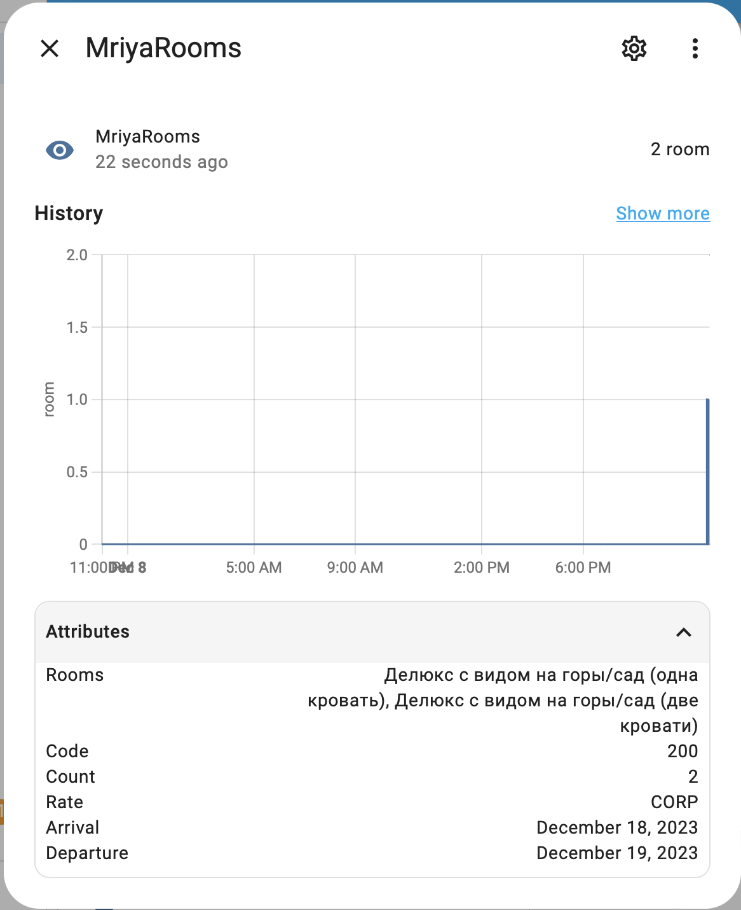
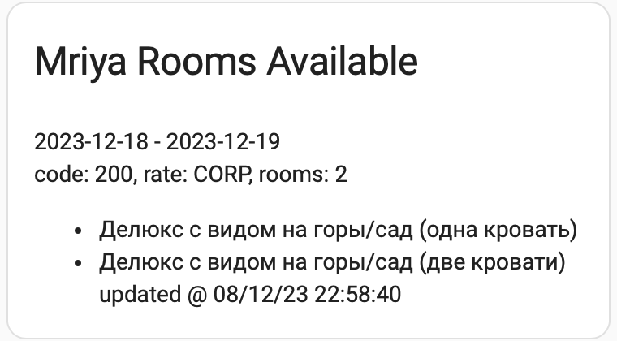

# Монитор свободных комнат по корпоративному тарифу в отеле Mriya Resort & Spa

Позволяет настроить автоматическую проверку свободных комнат по корпоративному и специальному тарифу.

get_sberid_token.js - обновляет sberid токен для выполнения поиска. токен действует около суток и требует ежедневного обновления.
при истечении токена, в приложение SBOL будет отправляться запрос подтвердить вход, который нужно подтверждать раз в сутки.

get_rooms.py - получает список свободных комнат по указанному тарифу и выводит в JSON-формате

## Инструкция по установке
1. Настройте даты начала и конца поиска: arrival, departure в get_rooms.py. Выберите тариф в rate: CORP или SPEC. Можете изменить набор гостей через параметр data.
2. Укажите номер телефона в переменной phone в файле get_sberid_token.js - он будет использоваться для запроса авторизации в sberid.
3. Загрузите файлы get_rooms.py и get_sberid_token.js в /config/ папку home assistant или другой сервер.
4. Для ARM платформы и корректного выполнения get_sberid_token.js соберите docker-образ с node+puppeteer+chrome командой "docker build . --name sberidtoken"
5. Запустите программу обновления токена командой bash run.sh - она будет работать в фоне и обновлять токен.
6. Добавьте сенсор в home assistant configuration.yaml по примеру из файла hass_config_example.yml
7. Настройте карточку lovelace с помощью lovelace_example.yml 
8. Для отправки пуша на телефон при изменении кол-ва свободных комнат, настройте автоматизацию по примеру automation_example.yaml

## Сенсор добавляется в configuration.yaml по примеру из hass_config_example.yml 

## Пример lovelace карточки lovelace_example.yml 

